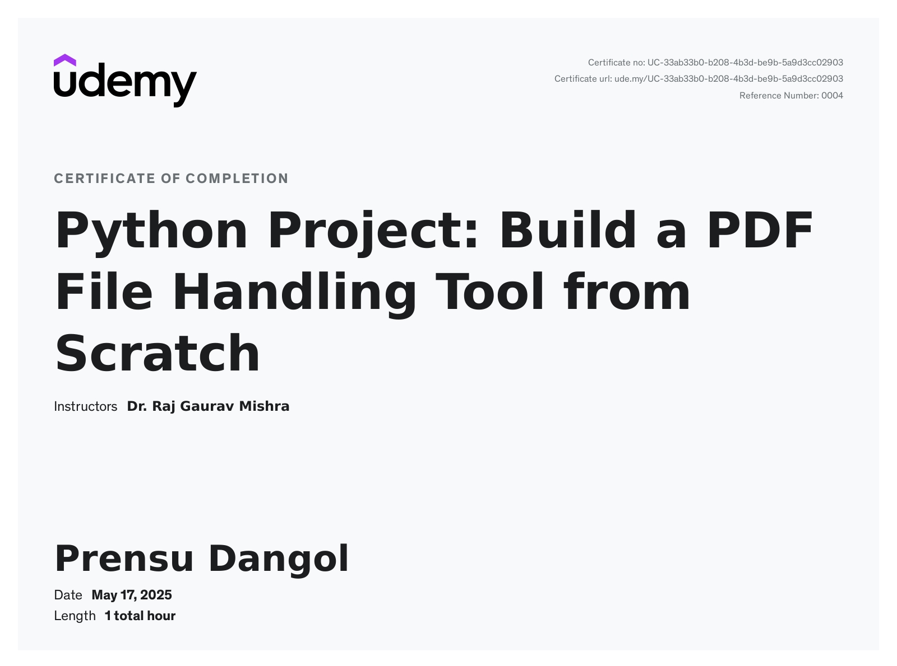

# 🐍 PDF File Handling using Python

This project is a hands-on implementation of PDF manipulation tools using Python, based on the **"PDF File Handling using Python"** course. It covers everything from merging, splitting, and extracting content to encryption, metadata handling, and building an executable PDF utility.

Certificate Link:https://www.udemy.com/certificate/UC-33ab33b0-b208-4b3d-be9b-5a9d3cc02903/



## 📚 Course Overview

### 📖 Section 1: Introduction
- Overview of the course and its goals.

### 🧰 Section 2: PDF File Handling using Python
- ✅ Merging PDFs
- ✅ Splitting PDFs
- ✅ Extracting Text
- ✅ Extracting Images
- ✅ Encrypting PDFs
- ✅ Decrypting PDFs
- ✅ Rearranging Pages
- ✅ Rotating Pages
- ✅ Adding Metadata
- ✅ Optimizing PDFs

### 🔧 Section 3: Build a PDF File Handling Tool
- ✅ Creating a `.exe` from Python using tools like `pyinstaller`.

## 🚀 Features Implemented

- 📄 Combine multiple PDF files into one
- ✂️ Split one PDF into multiple smaller ones
- 🔍 Extract text and images
- 🔐 Add or remove password protection
- 🔄 Rearrange or rotate pages
- 📝 Add/edit metadata (title, author, etc.)
- 📦 Compress and optimize file size
- ⚙️ Build a standalone EXE tool

## 🛠 Requirements

- Python 3.x
- Install dependencies:
  ```bash
  pip install PyPDF2 pillow PyMuPDF reportlab pyinstaller
  ```

## ⚙️ How to Run

```bash
python main.py
```

To build an executable (Windows):
```bash
pyinstaller --onefile main.py
```

## 📁 Project Structure

```
📂 pdf_tool_project/
├── main.py
├── utils/
│   ├── merge.py
│   ├── split.py
│   ├── extract_text.py
│   ├── extract_images.py
│   └── ...etc
├── assets/
│   └── demo.png
├── README.md
```

## 🧠 Skills Learned

- PDF parsing and generation
- Python scripting and packaging
- Real-world problem solving
- Tool-building for automation

## 📝 License

This project is for educational purposes based on a course. Modify and use it freely for personal or commercial use.

## 🙌 Acknowledgements

Thanks to the instructor of the course **"PDF File Handling using Python"** for this well-structured and practical guide.
